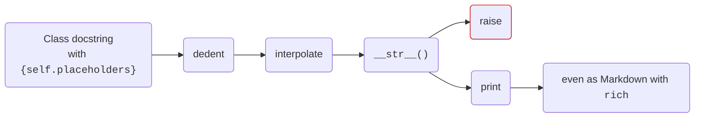

[](https://pypi.org/project/documented/)
[](https://github.com/wemake-services/wemake-python-styleguide)


Templated docstrings for Python classes.

## Example

{{ run_python_script("examples/open-the-pod-bay-doors.py") }}

## Process



## Features

!!! info inline "In your docstrings"
    Describe an object, or an exception, in your docstring, and use `{self.placeholders}` to include its fields & properties

!!! info inline "Print or raise the object"
    The docstring with resolved `{self.placeholders}` will be its string representation

!!! info inline "Result"
    Human readable text as the output, or log, of your application.

!!! info inline "More"
    [See docs](formatting/){ .md-button }

<br clear="both">

## Installation

```bash
pip install documented
```

This project was generated with [`wemake-python-package`](https://github.com/wemake-services/wemake-python-package).
