# `documented`

[](https://pypi.org/project/documented/)
[](https://github.com/wemake-services/wemake-python-styleguide)


Templated docstrings for Python classes.

## Example

{{ run_python_script("examples/open-the-pod-bay-doors.py") }}

## Installation

`documented` is on [:simple-pypi: PyPI](https://pypi.org/project/documented).

=== "pip"
    ```bash
    pip install documented
    ```

=== ":simple-poetry: poetry"
    ```bash
    poetry add documented
    ```

=== "pipenv"
    ```bash
    pipenv install documented
    ```

=== "pdm"
    ```bash
    pdm add documented
    ```

=== ":simple-condaforge: conda"

    ```bash
    conda install -c conda-forge documented
    ```


## :octicons-workflow-24: Flow

```mermaid
graph TD
    A("Class docstring<br>with <code>{self.placeholders}</code>") --> dedent("↤ dedent")
    dedent --> C("Interpolate<br><code>{self.placeholders}</code>")
    C --> str("<code>__str__()</code>")
    str -- "for<br><code>DocumentedError</code>" --> raise("💥 raise")
    str -- "for<br><code>Documented</code>" --> print("🖨️ print | log")
    print --> rich("as Markdown → console<br>with 🖥️ <code>rich</code>")
    raise --> try("🏀 try … except")
    raise -- Stacktrace --> print
    try --> print
    
    style raise stroke:#CC0000
    click dedent "https://docs.python.org/3/library/textwrap.html#textwrap.dedent"
    click C "formatting/"
    click rich "compatibility/rich/"
    click str "https://docs.python.org/3/reference/datamodel.html#object.__str__"
    click try "try-except/"
    
```


