# `documented`

[](https://pypi.org/project/documented/)
[](https://github.com/wemake-services/wemake-python-styleguide)


Templated docstrings for Python classes.

## Example

{{ run_python_script("examples/open-the-pod-bay-doors.py") }}

## Installation

`documented` is on [:simple-pypi: PyPI](https://pypi.org/project/documented).

=== "pip"
    ```bash
    pip install documented
    ```

=== ":simple-poetry: poetry"
    ```bash
    poetry add documented
    ```

=== "pipenv"
    ```bash
    pipenv install documented
    ```

=== "pdm"
    ```bash
    pdm add documented
    ```

=== ":simple-condaforge: conda"

    ```bash
    conda install -c conda-forge documented
    ```


## :octicons-workflow-24: Flow

```mermaid
graph TD
    docstring("Class 📝 <code>docstring</code>") --> dedent("↤ dedent")
    dedent --> C("✏️ Interpolate<br><code>{self.placeholders}</code>")
    C --> str("<code>__str__()</code>")
    str -- "for<br><code>DocumentedError</code>" --> raise("💥 raise")
    str -- "for<br><code>Documented</code>" --> print("🖨️ print | log")
    print --> rich("as Markdown → console<br>with 🖥️ <code>rich</code>")
    raise --> try("🏀 try … except")
    raise -- Stacktrace --> print
    try --> print
    
    style raise stroke:#CC0000
    click dedent "https://docs.python.org/3/library/textwrap.html#textwrap.dedent"
    click C "templating/"
    click rich "compatibility/rich/"
    click str "https://docs.python.org/3/reference/datamodel.html#object.__str__"
    click try "try-except/"
    click docstring "docstring/"
    
```



## :package: Used by

The asterisk :material-asterisk: below denotes projects which are mine :slight_smile:

!!! info inline "[iolanta](https://iolanta.tech)"
    Linked Data workspace :material-asterisk:

!!! info inline "[jeeves](https://jeeves.sh)"
    Pythonic alternative to Make :material-asterisk:

!!! info inline "Know more?"
    [:heavy_plus_sign: Submit an issue!](https://github.com/anatoly-scherbakov/documented/issues/new)

<br clear="both"/>

## :material-phone-in-talk: Let's talk

!!! info inline "Bug? Feature request?"
    [:heavy_plus_sign: Submit an issue!](https://github.com/anatoly-scherbakov/documented/issues/new)

!!! info inline "Anything else?"
    See my site: [:material-web: yeti.sh](https://yeti.sh)

<br clear="both"/>

## :fontawesome-regular-paper-plane: Publications

* [`documented`: make docstrings in your exceptions work](https://dev.to/anatolyscherbakov/documented-make-docstrings-in-your-exceptions-work-2kcf)
