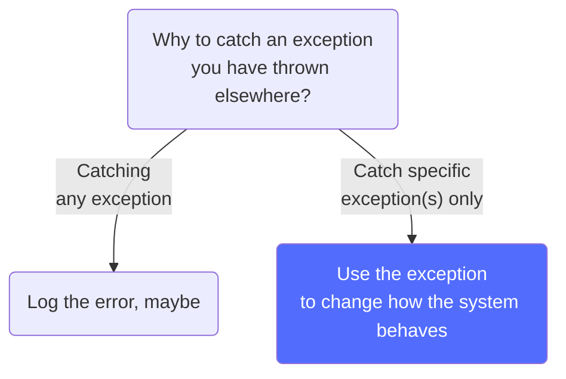

# :basketball: `try`…`except`



!!! info inline end "Read more on this"
    [:paperclip: Exceptions as Control Flow](https://blog.cerebralab.com/Exceptions_as_control_flow){ .md-button .md-button--primary }

Python `except` construct allows to manage how the application behaves depending on which exception has been raised. `documented` stimulates to add fields and properties to your exception classes, which you can neatly use in `except` clauses:

```python
try:
    hal.do_stuff()
except HALHasGoneCrazy as err:
    if err.is_moebius_cycle:
        hal.turn_off()
    else:
        hal.self_check()
```
